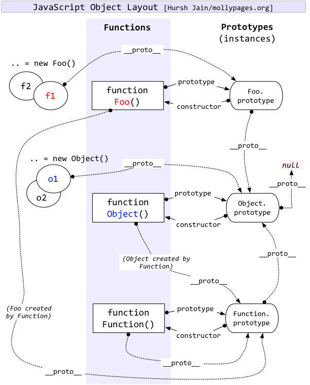

# 前言
在Javascript中，最具有特色的知识点莫过于：作用域链、原型&原型链、闭包。关于语言的通用特性莫过于封装类、继承、多态性......JS有关对象的体系确实与其他语言不一样，JS继承是基于原型体系而非类体系。本文将对<u>对象、类、继承、实例、原型、原型链</u>这一系列名词进行阐述和分析(*是什么？从哪里来？到哪里去？*)。

# 对象

What：

Why：

How：下文将对其阐述。

## 对象类型
在Javascript中，万物皆对象，但在看待对象这个问题上是有很多坑的，因为这个范围广而模糊！Eg: 以传统语言的方式来理解，你能分清对象、类、实例and它们在代码层面上是如何区分以及他们间的关系吗？回答这个问题前还有个重要的问题需要先搞懂，那就是JS里的对象类型有哪些？而JS里最容易搞混的就是**Object对象**和**Function对象**，看看JS解释器是怎么区分的！
``` javascript
var obj = new Object();
var num = new Number();
var str = new String();
var bool = new Boolean();
var date = new Date();
var arg = function(){ return arguments }();
var reg = new RegExp();
var func = new Function();
var arr = new Array();
var err = new Error();
console.log([obj, num, str, bool, date, arg, reg, func, arr, err].map(v => Object.prototype.toString.call(v))); 

function func1(){
 // 函数声明构造函数
 // Function类的实例化a
}
var func2 = function(){
 // 匿名函数定义构造函数
 // Function类的实例化b
}
// 调用Function构造函数，Function类实例化
var func3 = new Function(); 

var obj1 = {}; // 对象字面量
var obj2 = new Object(); // 调用构造函数对象原型
var obj3 = new func1(); 
var obj4 = new func2();

typeof func1; // Function
typeof func2; // Function
typeof func3; // Function
typeof obj1; // Object
typeof obj2; // Object
typeof obj3; // Object
typeof obj4; // Object
```
起始func1,func2,func3都是一样的，都是JS（自动）通过new Function()的方式来构建的对象。这里会注意到，obj3,obj4并不是Function类型而属于Object类型。因为只有new Function()方式实现的类才是Function类型。至于为什么不一样的底层原因，这就要谈及原型对象和原型链了...
## 原型&类
目前来看，语言分为2种：1.基于类面向对象的语言(以Java为首)；2.**基于原型面向对象**的语言(以JS为首)。
- Java中类可以看做是一个抽象的模板；而JS中类这个概念本质上只是prototype实现的语法糖。
- Java中总是先有类，再从类去实例化一个对象，类与类之间又可能会形成继承、组合等关系，类又往往与语言的类型系统整合，形成一定的编译时能力；而JS中更强调对象继承关系及对象实例的行为，是指上是通过类似复制的方式来创建新对象。

了解完JS和我们所知传统的基于类面向对象的语言的区别后，在来谈谈什么是原型...
**JS里万物皆对象，原型也是一个对象(可以对其改动，但一般不建议动态更改)！**顾名思义，对象是根据原型**“复制”**生成的，通俗的说法是“照猫画虎”。
原型对象被一般对象通过挂载prototype或\_\_proto\_\_指针来引用，那么这两个指针是什么？从哪里来？到哪里去？

- `\_\_proto\_\`_：**每个对象**都会有\_\_proto\_\_属性挂载其上作为一个引用指针指向其原型。此属性本不是web标准规范属性，部分浏览器实现了此功能。目前各大浏览器为保持兼容性，还支持此属性的使用，但web标准已经将此属性淘汰。
- `[[Prototype]]`：**每个对象**都会有[[Prototype]]属性挂载其上作为一个引用指针指向其原型。此属性是\_\_proto\_\_对应的标准属性，和\_\_proto\_\_等价使用。在浏览器引擎中，改变对象的[[Prototype]]是一种非常慢的操作，其影响是微妙、深远的，并不仅仅是一行代码的时间复杂度，在其背后任何可访问该[[Prototype]]的对象都发生了引用改变。此属性无法直接访问，但可通过下文提到的Object的内置方法进行原型操作。
- `prototype`：上面已经说得很明白了，函数也是对象，故**函数对象必然是有[[Prototype]]属性的。但除此外，Function对象还有一个额外的prototype属性，**该属性也作为一个引用指针挂载其上指向一个对象，这个对象正是调用该构造函数而创建的对象的原型(对象)。
- `constructor`：每个对象都有constructor属性挂载其上作为一个引用指针指向创造该对象的构造函数。

```javascript
// constructor
var obj1,obj2;
(function(){
  function Obj(arg1,arg2) {
    this.a = 1;
    this.b=2; 
  }

  Obj.prototype.log = function () {
    console.log(this.a);
  }
  obj1 = new Obj();
  obj2 = new Obj();
})()

obj1.log(); // 1
obj2.log(); // 1

obj1.constructor.prototype.log2 = function () {
  console.log(this.b)
}

obj1.log2(); // 2
obj2.log2(); // 2
```

## Object.create()
Object.create(proto, [propertiesObject])：根据指定的原型创建新对象，原型可以是 null；

- `proto`：必写。**新创建对象的原型**；
- `propertiesObject`：非必写，如果没有指定为undefined，则是要添加到新创建对象的可枚举属性（即其自身定义的属性，而不是其原型链上的枚举属性）对象的属性描述符以及相应的属性名称。

```javascript
var obj1 = Object.create({});
console.log(obj1.__proto__); // {}
console.log(obj1.prototype); // undefined
console.log(obj1.constructor); // ƒ Object() { [native code] }
console.log(Object.getPrototypeOf(obj1)); // {}

var obj2 = Object.create(null);
console.log(obj2.__proto__); // undefined
console.log(obj2.prototype); // undefined
console.log(obj2.constructor); // undefined
console.log(Object.getPrototypeOf(obj2)); // null

var cat = {
    say(){
        console.log("meow~");
    },
    jump(){
        console.log("jump");
    }
};
var tiger = Object.create(cat,  {
    say:{
        writable:true,
        configurable:true,
        enumerable:true,
        value:function(){
            console.log("roar!");
        }
    }
});

var anotherCat = Object.create(cat);
anotherCat.say();
var anotherTiger = Object.create(tiger);
anotherTiger.say();

console.log(anotherCat.__proto__); // {say:f, jump: f}
console.log(anotherCat.prototype); // undefined
console.log(Object.getPrototypeOf(anotherCat)); // {say:f, jump: f}
console.log(anotherCat.constructor); // ƒ Object() { [native code] }
```
## 对象字面量
```javascript
const Person = {
    name: 'adam',
    age: 23
};
Person.constructor; // ƒ Object() { [native code] }
Person.__proto__; // {constructor: ƒ, __defineGetter__: ƒ, __defineSetter__: ƒ, hasOwnProperty: ƒ, __lookupGetter__: ƒ, …}
Person.prototype; // undefined
Object.getPrototypeOf(Person); // {constructor: ƒ, __defineGetter__: ƒ, __defineSetter__: ƒ, hasOwnProperty: ƒ, __lookupGetter__: ƒ, …}
```
## new关键字

- `new constructor`：自定义函数，然后通过 `new+函数` 产出新对象，产出的不是Function对象(**对象类型为函数名**)；
  - 创建一个新对象 `{}`;
  - 将该函数的 `prototype属性` 赋给对象实例的`[[prototype]]即__proto__`；
  - 将构造函数的作用域赋给新对象（因此 this 就指向了这个新对象）；
  -  执行构造函数中的代码（为这个新对象添加属性） ；
  - 返回函数定义时的对象返回值 || 返回新对象；
- `new Object()`：同上，只不过这里构造函数为内置的名为Object的函数对象；

```javascript
function Man() {
    this.name = 'frank';
}
var man = new Man();
var obj = new Object();

console.log(Man.name); // "Man"
console.log(man.name); // "frank"
console.log(obj.name); // undefined

console.log(man.constructor); // f Man() {}
console.log(man.__proto__); // { construcot: f Man() }
console.log(man.prototype); // undefined

console.log(obj.constructor); // ƒ Object() { [native code] }
console.log(obj.__proto__); // {constructor: ƒ, __defineGetter__: ƒ, __defineSetter__: ƒ, hasOwnProperty: ƒ, __lookupGetter__: ƒ, …}
console.log(obj.prototype); // undefined
```

## class关键字
ES6中，作为定义类的关键字加入JS，令 function 回归原本的函数语义，且对getter/setter 和 method 是兼容性是最好的。class写法只是让对象原型写法更加清晰，更像基于类面向对象的感觉而已。class实际上也是由原型运行时来承载的，逻辑上 JavaScript 认为每个类是有共同原型的一组对象，类中定义的方法和属性则会被写在原型对象之上。

- **类的数据类型就是函数，类本身就指向构造函数**；
- **类内部定义的方法实际上绑定在构造函数对应的原型上，且皆不可枚举**(*与ES5不同*)；
- 与ES5 一样，实例的属性除非显式定义在其本身（即定义在this对象上），否则都是定义在原型上（即定义在class上）；
- 类的方法内部如果含有this，它默认指向类的实例。

```javascript
function Person(name, age) {
    this.name = name;
    this.age = age;
}
Person.prototype.sayHi = function() {
    return `I'm ${this.name}, ${this.age} years old.`;
}
/* ---分割线--- */
class Person {
    constructor(name, age) {
        this.name = name;
        this.age = age;
    }
    // Getter
    get introduction() {
        return  this.sayHi();
    }
    // Method
    sayHi() {
        return `I'm ${this.name}, ${this.age} years old.`;
    }
}
const person =  new Person('adam', 30);
console.log(person.introduction); // I'm adam, 30 years old.

Person.__proto__; // ƒ () { [native code] }
Person.prototype; // {constructor: ƒ, sayHi: ƒ}
Object.getPrototypeOf(Person); // ƒ () { [native code] }
Person.constructor; // ƒ Function() { [native code] }

person.__proto__; // {constructor: ƒ, sayHi: ƒ}
person.prototype; // undefined
Object.getPrototypeOf(person); // {constructor: ƒ, sayHi: ƒ}
person.constructor; /* class Person {
    constructor(name, age) {
        this.name = name;
        this.age = age;
    }
    // Getter
    get introduction() {
        return  this.sayHi();
    }
    // Method
    sayHi() {
  …*/

typeof Person; // "function"
Person === Person.prototype.constructor; // true
Person.name // "Person"
```
# 继承

What：实际上，js是没有类的，`class`只是一个由`[[prototype]]`底层实现的关键字、语法糖。	理论上，对象A拥有对象B的所有属性、方法，可认为该A是B**实例**；一个对象A不仅拥有另一	个对象B的所有属性、方法，还有其他的属性、方法，可认为A**继承**自B。

Why：提高代码的可重用性，实现高内聚、低耦合。

How：下文将对其阐述。

## 原型链
同所有面向对象语言一样，继承是JS必不可少的。但是上文已提到JS是基于原型的，在继承的实现上是由区别于Java（基于类面向对象的）的。无论语法糖怎么装饰、ES版本怎么更迭，**JS继承的核心始终是通过原型链实现的，且本质上继承的是父类的原型**。
- `__proto__ `：web标准规范未形成时的一种解决方案(大部分浏览器都支持)，也是目前为止使用率最高的继承手法。**对象属性和方法的查找原理是JS解释器会从当前对象开始顺着\_\_proto\_\_依次向上查找，直到\_\_proto\_\_指向null为止。**故开发者们甚至直接在对象上进行\_\_proto\_\_指针引用赋值以达到继承效果。
-  `instanceof`：用于测试**构造函数的prototype**是否出现在该对象的原型链中的任何位置。
- `[[Prototype]]` & Object内置函数：web标准规范推荐使用，未来大势所趋。手法为Object.create() & Object.setPrototypeOf()，使继承趋于规范化格式化。其原理和效果跟\_\_proto\_\_并无差异。



## 借用原型链
`new + 构造函数`：

- 模拟Java继承：“类是模板，new出的对象就是实例”。

- new出的对象被赋值给**Function对象的prototype**，如此而来可以继续通过new继承，被赋值的Function对象只负责进行"类"的继承。


注意点：
  - 父类原型被子类对象们共享，若直接对子类对象原型进行操作会影响其他[[prototype]]指向该父类原型的对象；
  - 父类被过早创建，如`Papa.prototype = new Grandpa();` 导致无法接受子类的动态参数；

```javascript
function Grandpa(name){
 if (name) {
  this.name=name;
 } else {
  this.name='grandpa'
 }
 this.age='60';
}
function Papa(name) {
 if (name) {
  this.name=name;
 } else {
  this.name='papa';
 }
 this.age='30';
}
function Son(name) {
 if (name) {
  this.name=name;
 } else {
  this.name='son';
 }
 Son.prototype.age = "10";
}
Grandpa.prototype.age = "60";
Papa.prototype.age = "30";
Papa.prototype = new Grandpa();
Son.prototype = new Papa();
var grandpa = new Grandpa();
var papa = new Papa('frank');
var uncle = new Grandpa('wong');
var son = new Son();
var cousin = Object.create(uncle.__proto__);

console.log(grandpa.name, grandpa.age); // "grandpa" "60"
console.log(papa.name, papa.age); // "frank" "60"
console.log(uncle.name, uncle.age); // "wong" "60"
console.log(son.name, son.age); // "son" "10"
console.log(cousin.name, cousin.age); // undefined "60"

Grandpa.__proto__; // ƒ () { [native code] }
Papa.__proto__; // ƒ () { [native code] }
Son.__proto__; // ƒ () { [native code] }
grandpa.__proto__; // {age: "60", constructor: ƒ Grandpa, __proto__: Object}
papa.__proto__; // Grandpa {name: "grandpa", age: "60", __proto__: {age: "60", constructor: f Grandpa, __proto__: Object}}
uncle.__proto__; // {age: "60", constructor: ƒ Grandpa, __proto__: Object}
son.__proto__; // {name: "papa", __proto__: Grandpa}
cousin.__proto__; // {age: "60", constructor: ƒ Grandpa, __proto__: Object}

Grandpa.prototype; // {age: "60", constructor: ƒ Grandpa, __proto__: Object}
Papa.prototype; // Grandpa {name: "grandpa", __proto__: Object}
Son.prototype; // Grandpa {name: "papa", __proto__: Grandpa}
grandpa.prototype; // undefined
papa.prototype; // undefined
uncle.prototype; // undefined
son.prototype; // undefined
cousin.prototype; // undefined

Object.getPrototypeOf(Grandpa); // ƒ () { [native code] }
Object.getPrototypeOf(Papa); // ƒ () { [native code] }
Object.getPrototypeOf(Son); // ƒ () { [native code] }
Object.getPrototypeOf(grandpa); // {age: "60", constructor: ƒ}
Object.getPrototypeOf(papa); // Grandpa {name: "grandpa", __proto__: Object}
Object.getPrototypeOf(uncle); // {age: "60", constructor: ƒ Grandpa, __proto__: Object}
Object.getPrototypeOf(son); // {name: "papa", __proto__: Grandpa}
Object.getPrototypeOf(cousin); // {age: "60", constructor: ƒ Grandpa, __proto__: Object}

papa instanceof Grandpa; // true
papa instanceof Papa; // true
uncle instanceof Grandpa; // true
son instanceof Papa; // true
son instanceof Grandpa; // true
cousin instanceof uncle; // Uncaught TypeError: Right-hand side of 'instanceof' is not callable
cousin instanceof Grandpa; // true
```
## 借用构造函数

`constructor + call/apply`：模拟Java继承：“类是模板，new出的对象就是实例”。

- 在子类的构造函数中内部调用父类的构造函数。

- 调用父类构造函数可以理解为在当前构造函数作用域下复用了父类的构造函数，其本质与在子类构造函数里直接copy父类构造函数进行数据、逻辑处理无异。
- 保证了原型链中引用类型的独立，不被所有实例共享。
- 子类并没有继承父类原型(属性&方法)。
- 无法通过`instanceof`进行继承关系判断。

```javascript
function Grandpa(name, age){
 if (name && age) {
  this.name= name;
  this.age=age; 
 } else {
  this.name='grandpa';
  this.age='60'; 
 }
}
function Papa(name, age) {
 Grandpa.call(this, name, age);
 this.age='30'; // 参考第二点
}
function Son(name, age) {
 Papa.call(this, name, age);
 Son.prototype.age = "10";
}
var grandpa = new Grandpa();
var papa = new Papa('frank', '30');
var uncle = new Papa()
var son1 = new Son();
var son2 = new Son('wong', '10');

console.log(grandpa.name, grandpa.age); // "grandpa" "60"
console.log(papa.name, papa.age); // "frank" "30"
console.log(uncle.name, uncle.age); // "grandpa" "30"
console.log(son1.name, son1.age); // "grandpa" "30"
console.log(son2.name, son2.age); // "wong" "30"

grandpa.__proto__; // {constructor: f Grandpa, __proto__: Object}
papa.__proto__; // {constructor: f Papa, __proto__: Object}
uncle.__proto__; // {constructor: f Papa, __proto__: Object}
son1.__proto__; // {age: "10", constuctor: f Son, __proto__: Object}
son2.__proto__; // {age: "10", constructor: f Son, __proto__: Object}

grandpa instanceof Grandpa; // true
papa instanceof Papa; // true
papa instanceof Grandpa; // false
uncle instanceof Papa; // true
uncle instanceof Grandpa; // false
son1 instanceof Grandpa; // false
son1 instanceof Papa; // false
son1 instanceof Son; // true
son1 instanceof Object; // true
```
## 组合式
`借用构造函数 + 借用原型链`：模拟Java继承：“类是模板，new出的对象就是实例”。

- **原型链实现原型对象属性和方法的继承，借用构造函数实现实例属性的继承**。
- 方法绑定在`prototype`原型对象上，实现函数复用。
- 属性定义在constructor里，每个对象有属于自己的属性。
- 父类构造函数被调用了两次，存在不必要消耗。
- 子类没法动态传递参数给父类。

```javascript
function Grandpa(name, age){
 if (name && age) {
  this.name= name;
  this.age=age; 
 } else {
  this.name='grandpa';
  this.age='60'; 
 }
}
function Papa(name, age) {
 Grandpa.call(this, name, age);
 this.age='30';
 Papa.prototype.getter = function() {
   console.log(this.name, this.age); 
 }
}
function Son(name, age) {
 Papa.call(this, name, age);
 Son.prototype.age = "10";
}
Grandpa.prototype.age = "60";
Papa.prototype.age = "30";
Papa.prototype = new Grandpa();
Son.prototype = new Papa();
var grandpa = new Grandpa();
var papa = new Papa('frank');
var uncle = new Grandpa('wong', "20");
var son = new Son();

console.log(grandpa.name, grandpa.age); // "grandpa" "60"
console.log(papa.name, papa.age); // "grandpa" "30"
console.log(uncle.name, uncle.age); // "wong" "20"
console.log(son.name, son.age); // "grandpa" "30"

grandpa.__proto__; // Grandpa {age:"60", name:"grandpa", __proto__:{age:"60", constructor: f Grandpa, __proto__: Object}}
papa.__proto__; // Grandpa {age:"60", name:"grandpa", __proto__:{age:"60", constructor: f Grandpa, __proto__:Object}}
uncle.__proto__; // {age:"60", constructor: f Grandpa, __proto__: Object}
son.__proto__; // {name:"grandpa", age:"10", __proto__: Grandpa}

Grandpa.prototype; // {age:"60", constructor: f Grandpa, __proto__:Object}
Papa.prototype; // Grandpa {age:"60", name:"grandpa", __proto__:{age:"60", constructor: f Grandpa, __proto__:Object}}
Son.prototype; // {age:"10", name:"grandpa", __proto__:Grandpa}
grandpa.prototype; // undefined 其余实例对象同理

grandpa instanceof Grandpa; // true
papa instanceof Grandpa; // true
papa instanceof Papa; // true
son instanceof Grandpa; // true
son instanceof Papa; // true
son instanceof Son; // true
son instanceof grandpa; // Uncaught TypeError: Right-hand side of 'instanceof' is not callable
```

## 寄生组合式

`寄生继承`：依托于一个对象而生的一种继承方式。

`寄生 + 组合式`：用寄生继承的方式去改造组合式继承。

- 构造函数只调用了一次。
- 子类可以传递动态参数给父类。
- 子类继承了父类的属性和方法，新属性不会被创建在原型链上，因为**子类们不会共享同一个父类原型**。

```javascript
// 寄生继承
function inherit(child, parent) {
    const p = Object.create(parent.prototype)
    // child.prototype = p; 
    // 子类想要在原型上添加方法，必须在继承之后添加，否则将覆盖掉原有原型上的方法
    child.prototype = Object.assign(p, child.prototype); // 
    p.constructor = child
}
function Grandpa(name, age){
 if (name && age) {
  this.name= name;
  this.age=age; 
 } else {
  this.name='grandpa';
  this.age='60'; 
 }
}
function Papa(name, age) {
 Grandpa.call(this, name, age);
 this.age='30'; // 参考第二点
}
function Son(name, age) {
 Papa.call(this, name, age);
 Son.prototype.age = "10";
}
inherit(Papa, Grandpa);
inherit(Son, Papa);
var grandpa = new Grandpa();
var papa = new Papa('frank', '30');
var uncle = new Papa()
var son1 = new Son();
var son2 = new Son('wong', '10');

console.log(grandpa.name, grandpa.age); // "grandpa" "60"
console.log(papa.name, papa.age); // "frank" "30"
console.log(uncle.name, uncle.age); // "grandpa" "30"
console.log(son1.name, son1.age); // "grandpa" "30"
console.log(son2.name, son2.age); // "wong" "30"

grandpa.__proto__; // {constructor: f Grandpa, __proto__: Object}
papa.__proto__; // Grandpa {constructor: f Papa, __proto__:{constructor: f Grandpa, __proto__:Object}}
uncle.__proto__; // // Grandpa {constructor: f Papa, __proto__:{constructor: f Grandpa, __proto__:Object}}
son1.__proto__; // {age: "10", constuctor: f Son, __proto__: Grandpa}
son2.__proto__; // {age: "10", constuctor: f Son, __proto__: Grandpa}

grandpa instanceof Grandpa; // true
papa instanceof Papa; // true
papa instanceof Grandpa; // true
uncle instanceof Papa; // true
uncle instanceof Grandpa; // true
son1 instanceof Grandpa; // true
son1 instanceof Papa; // true
son1 instanceof Son; // true
son1 instanceof Object; // true
```

## Object API

`Object.create(proto, [propertiesObject])`：web标准规范推荐使用此方法(除了class & extends)，MDN可查。

- `proto`：返回的新对象的原型对象；
- `propertiesObject`：可选。如果没有指定为 undefined，则是要添加到新创建对象的可枚举属性（即其自身定义的属性，而不是其原型链上的枚举属性）对象的属性描述符以及相应的属性名称。这些属性对应`Object.defineProperties()`的第二个参数。
- 返回值：一个新对象，带着指定的原型对象和属性。

可以通过属性直接在对象上操作`\_\_proto\_\_`和`prototype`进行引用，不过不推荐。官方为Oject对象内置了可操作原型的方法：

- `Object.getPrototypeOf(obj)`：获得一个对象的原型；
- `Object.setPrototypeOf(obj, prototype)`：设置一个对象的原型(*仅适用于Chrome和FireFox，在IE中不工作*)；

注意点：

- Object返回的是一个仅有配置好`[[prototype]]`属性的对象，所以需要自行为复写的子类原型配置`constructor`指针； Eg: {\_\_proto\_\_: {...}}

```javascript
function Grandpa(name, age){
 if (name && age) {
  this.name= name;
  this.age=age; 
 } else {
  this.name='grandpa';
  this.age='60'; 
 }
}
function Papa(name, age) {
 Grandpa.call(this, name, age);
 this.age='30';
}
function Son(name, age) {
 Papa.call(this, name, age);
 Son.prototype.age = "10";
}
Grandpa.prototype.age = "60";
Papa.prototype.age = "30";
Papa.prototype = Object.create(Grandpa.prototype);
Papa.prototype.constructor = Papa;
Son.prototype = Object.create(Papa.prototype);
Son.prototype.constructor = Son;
var grandpa = new Grandpa();
var grandpa1 = Object.create(Grandpa.prototype);
var papa = new Papa('frank');
var uncle = new Grandpa('wong', "20");
var son = new Son();

console.log(grandpa.name, grandpa.age); // "grandpa" "60"
console.log(papa.name, papa.age); // "grandpa" "30"
console.log(uncle.name, uncle.age); // "wong" "20"
console.log(son.name, son.age); // "grandpa" "30"

grandpa.__proto__; // {age:"60", constructor:f Grandpa, __proto__:Object}
papa.__proto__; // Grandpa {constructor:f Papa, __proto__:{age:"60", constructor: f Grandpa, __proto__:Object}}
uncle.__proto__; // {age:"60", constructor: f Grandpa, __proto__: Object}
son.__proto__; // {age:"10", __proto__: Grandpa}

grandpa instanceof Grandpa; // true
papa instanceof Papa; // true
papa instanceof Grandpa; // true
uncle instanceof Papa; // false
uncle instanceof Grandpa; // true
son instanceof Grandpa; // true
son instanceof Papa; // true
son instanceof Son; // true
son instanceof Object; // true
```
## extends关键字

作为ES6新特性加入JS语法，极大地提高了JS对象&继承的可读性、项目工程化(TypeScript)。但其仅仅只是语法糖的存在，继承的背后原理及实现还是依靠于原型链。

- `class`：创建类模板的关键字，上文已阐述。
- `extends`：继承类的关键字，本质上还是在修改原型链。
- `constructor`：构造函数。
  - **类名变量指向的地址**。
  - 直接置于`class {xxx;}`中顶部的属性实质上与其构造函数内的`this.xxx`属性相同。
- `super` ：
  - 作为函数调用时，代表父类的构造函数。ES6要求子类构造函数必须执行一次`super()`。本质上相当于在子类构造函数中执行`ParentClass.prototype.constructor.call(this)`。
  - super作为对象时：①在普通方法中，指向父类的原型对象；②在静态方法中，指向父类。
- `static`：
  - static实现类的静态属性，可被类名变量直接调用，注意与实例属性的新写法区分。
  - static实现类的静态方法，静态方法不会被实例继承但会被子类继承。**静态方法中this指向这个类本身而非实例。**

```javascript
class Grandpa {
    constructor(name, age) {
        this.name = name;
        this.age = 60;
    }
}
class Papa extends Grandpa{
    constructor(name, age) {
        super(name, age);
        this.age = 30;
    }
}
class Son extends Papa{
    age = 10;
    constructor(name, age) {
        super(name, age);
    }
}
var grandpa = new Grandpa();
var papa = new Papa('frank', '30');
var uncle = new Papa()
var son1 = new Son();
var son2 = new Son('wong', '10');

console.log(grandpa.name, grandpa.age); // undefined 60
console.log(papa.name, papa.age); // "frank" 30
console.log(uncle.name, uncle.age); // undefined 30
console.log(son1.name, son1.age); // undefined 10
console.log(son2.name, son2.age); // "wong" 10

grandpa.__proto__; // {constructor: class Grandpa, __proto__: Object}
papa.__proto__; // Grandpa {constructor: class Papa, __proto__:{constructor:Grandpa, __proto__:Object}}
uncle.__proto__; // Grandpa {constructor: class Papa, __proto__:{constructor:Grandpa, __proto__:Object}}
son1.__proto__; // Papa {constuctor:class Son, __proto__: Grandpa}
son2.__proto__; // Papa {constuctor:class Son, __proto__: Grandpa}
```

# 小结
可能现在会觉得越看越混乱，多半是因为现在已经对于对象/类/实例这3个概念傻傻分不清了！在传统的编程语言体系(至少是C/C++/JAVA/PYTHON)里**类是一个抽象的模板。而实例则是类的具体化后的产物，此物也叫做对象。**而在JS实际操作甚至这篇文章里发现对象漫天飞，类用作对象，实例用作对象，居然还跑出一个原型对象，继承出来的到底是子类还是实例，混乱至极！但这才是JS的真相！精简一下你只需要注意一下几点：
- \_\_proto\_\_: 得从实例和原型的角度去看，这个引用属性指向什么，此对象的原型或父类就是什么。
- prototype: 得从构造函数的角度去看，这个引用属性指向什么，此对象的原型就是什么。
- constructor: 得从原型的角度去看，这个引用属性指向什么，此原型的构造函数是什么。
- 万事皆虚，万事皆允：甚至可以自己去diy这些属性手动引用，那么...以上全是屁话，不过容易出错！

JS在以上方面其设计原理我认为就有BUG，也导致了它的灵活性较高。往浅了说，老老实实写构造函数new实例，diy个类自己临时用用不需要复杂关系的直接用字面量；往深了说，各个属性引用了什么对象指向了哪里，每一个都得搞清楚，没有prototype的强行diy一个，再给人造原型加个\_\_proto\_\_，JS完成这样才能玩好。当然这只是冰山一角...希望以后的自己看到这篇文章能有新的理解并注入新的理解和想法。
